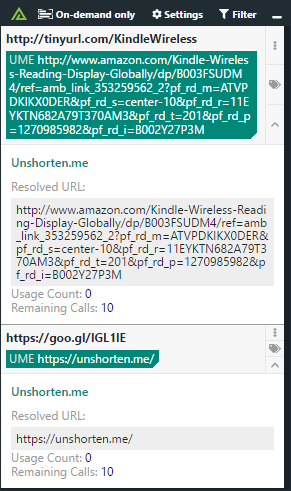

# Polarity Unshorten.me Integration

The Polarity Unshorten.me integration allows Polarity to Un-Shorten URLs created by URL shortening services.  The Unshorten.me service has a search limit of 10 requests per hour based on your IP address.  If the result has been cached by the Un-Shorten service then the search does not count against your limit.

The list of valid URL shortener services is populated using the MISP url-shortener warning list located here: https://github.com/MISP/misp-warninglists/tree/master/lists/url-shortener

|  |
|---|
|*Unshorten.me lookup example* |

## MISP Warning Lists Integration Options

### Enable Auto Update

If checked, the integration will automatically update the list of valid url-shortener services from the MISP github repository every Sunday at 11:00 PM (polarity server time). This setting must be set to "Only admins can view and edit". The integration must be able to issue a GET request to the MISP github repo located at `https://github.com/MISP/misp-warninglists` for auto updating to work.

## Installation Instructions

Installation instructions for integrations are provided on the [PolarityIO GitHub Page](https://polarityio.github.io/).

## Polarity

Polarity is a memory-augmentation platform that improves and accelerates analyst decision making.  For more information about the Polarity platform please see:

https://polarity.io/
